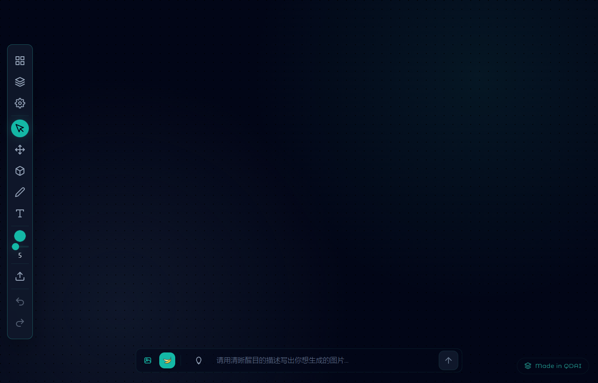
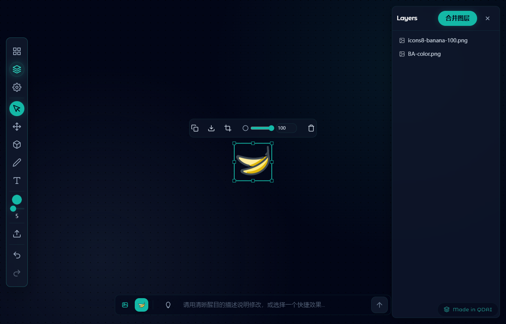
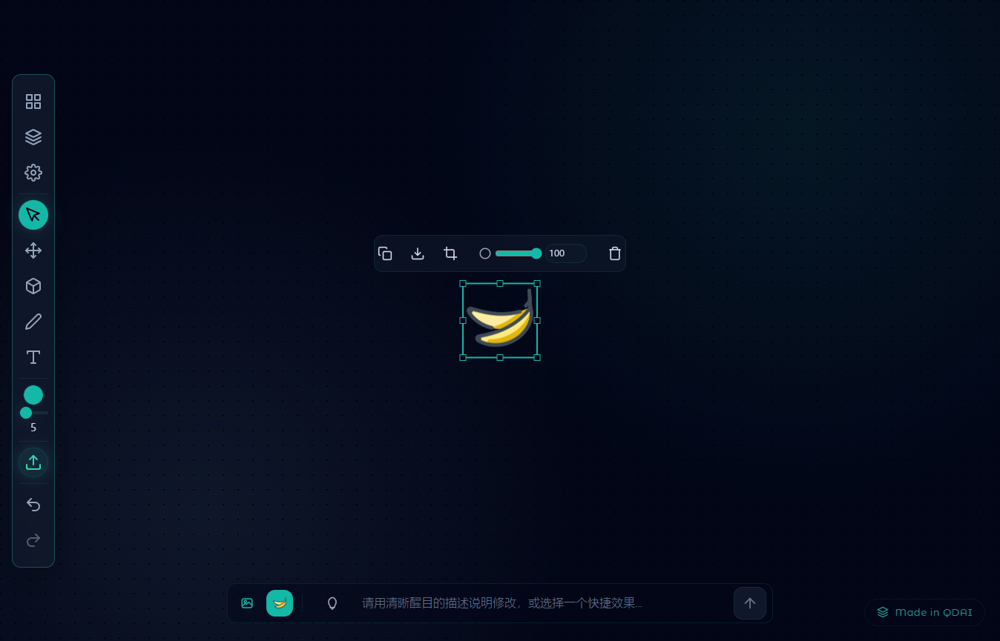

# BananaPod｜图像生成与编辑工作台（qd1.1.6 ）

轻量、可扩展的图像生成与编辑工作台，采用 PodUI 主题。统一第三方图像 API 为 OpenAI 风格接口（基于 `whatai.cc`），支持图层系统、裁剪与合并、对齐参考线、多画布看板、双语界面，以及 iPad / Apple Pencil 场景。



> 当前代码对应 Git 标签：`qd1.1.6`（分支：`rollback-qd0.1.0`）

---

## 版本亮点（qd1.1.6）

- 香蕉按钮面板嵌入网页区域放大且自适应屏幕高度，可展示更多内容。
- Prompt Lab 嵌入页面支持缩放与精确宽度控制，一行稳定展示 5 个场景卡片。
- 本地会话与历史记录存储更稳定，解决部分环境下 IndexedDB 版本冲突导致的加载异常。

---

## 功能概览

- 多画布看板
  - 支持创建多个 Board，在同一窗口中切换不同画布。
  - 每个 Board 独立维护元素、历史记录、背景色等状态。
- 图层系统
  - 图层面板支持显示/隐藏、锁定/解锁、重命名、排序与合并。
  - 支持群组、对齐、栅格化等高级操作。
- 形状与绘制
  - 矩形、圆形、三角形、线段、箭头、手绘路径等。
  - 支持填充色、描边色、线型（实线 / 虚线 / 点线）、线宽等属性调整。
- 文本与标签
  - 在画布任意位置点击添加文本。
  - 支持字号、颜色、对齐等基础排版。
- 图片导入与裁剪
  - 支持拖拽导入或通过工具栏上传本地图片。
  - 内置裁剪工具，支持多种宽高比预设。
- AI 生图与编辑（基于 `whatai.cc`）
  - 使用 `nano-banana`、`nano-banana-hd`、`nano-banana-2` 等模型进行生图与编辑。
  - 中英文提示词一键切换，保持 1:1 映射。
- 双语与主题
  - 支持中英文界面切换。
  - 内置 PodUI 主题，适配深色界面与卡片式布局。

### 界面示例

- 图层面板（可见 / 锁定 / 合并图层）

  

- 多图布局与右键浮动工具条（不透明度预览）

  

---

## 性能优化与交互改进（qd1.1.1）

### 历史记录深度限制

- 为每个 Board 的画布历史增加最大深度（约 50 步）。
- 当操作步数超过阈值时，最早的历史会被自动滚动丢弃，只保留最近一段时间的操作。
- 目标：
  - 在导入多张大图并频繁操作时，避免历史记录无限增长导致的内存膨胀和卡顿。
  - 保持撤销 / 重做在常规工作流中的可用性。

### 属性编辑「预览 / 提交」双通道

针对高频、连续拖动的属性，采用：

- 预览阶段：`onChange` 只更新当前帧，不写入历史。
- 提交阶段：在 `onMouseUp` / `onBlur` 时统一写入一次历史记录。

已接入的属性包括：

- 图片：不透明度（滑块 + 数值输入）。
- 矩形：圆角（滑块 + 数值输入）。
- 文本：字号（数值输入）。
- 线段 / 箭头：线宽（滑块）。

这样可以大幅减少“拖动一次滑块产生几十条历史”的情况，使撤销栈更干净，性能更稳定。

### 图片拖拽导入修复

- 修复了拖拽图片文件到画布时可能出现的多次触发问题。
- 现在每个文件拖拽事件只会导入一张对应图片，防止画布瞬间出现多张重复图片。

---

## 模型与接口（whatai 风格）

- 生图（Generations）：`nano-banana`、`nano-banana-hd`、`nano-banana-2`
  - 接口：`POST /v1/images/generations`
  - 返回：`{ data: [{ url }] }`
- 编辑（Edits）：`nano-banana`、`nano-banana-2`
  - 接口：`POST /v1/images/edits`
  - `nano-banana-2` 专属参数：`image_size`（`1K` / `2K` / `4K`）。
- 兼容 Gemini：
  - `gemini-3-pro-image-preview` 使用 `generateContent` 接口，统一解析图片输出。

### 枚举比例

- 支持的宽高比：
  - `1:1`、`2:3`、`3:2`、`3:4`、`4:3`、`4:5`、`5:4`、`9:16`、`16:9`、`21:9`
- 当模型为 `nano-banana-2` 且输入图不在枚举内时：
  - 自动裁剪为最近的枚举比例，避免服务端报错。

---

## 快速开始

- 环境要求：
  - Node.js 18+（建议 LTS 版本）
- 安装依赖：
  - `npm install`
- 启动开发环境：
  - `npm run dev`
  - 默认访问地址：`http://localhost:3001/`
- API 密钥：
  - 在应用内「设置」面板中填写并保存。
  - 密钥保存位置：`localStorage('WHATAI_API_KEY')`。

---

## 常用命令

- 开发：`npm run dev`
- 构建（生成 `dist/`）：`npm run build`
- 预览构建结果：`npm run preview`
- Electron 构建：
  - `npm run build:electron`
  - `npm run dist:win`
- 测试生图与编辑链路：`npm run test:banana`
  - PowerShell 示例：
    - `$env:WHATAI_API_KEY='<你的key>'; npm run test:banana`
  - 输出包含：`url` / `mime` / `size` 与图片下载校验结果。

---

## 开发与代理配置

- 开发代理：
  - 通过 Vite 代理到 `WHATAI_BASE_URL`（默认 `https://api.whatai.cc`）。
- 请求头：
  - 若请求未带 `Authorization`，代理层会自动附加 `Bearer <WHATAI_API_KEY>`。
- 端口：
  - 默认 `3001`，支持本机与局域网访问。

---

## 环境变量（可选）

- `WHATAI_API_KEY`：接口令牌（推荐通过设置面板填写）。
- `WHATAI_BASE_URL`：默认 `https://api.whatai.cc`。
- `WHATAI_IMAGE_MODEL` / `WHATAI_IMAGE_GENERATION_MODEL` / `WHATAI_IMAGE_EDIT_MODEL`：
  - 默认 `gemini-2.5-flash-image`。
- `PROXY_VIA_VITE`：
  - 默认 `true`，Electron 构建时可设为 `false`。

---

## 使用说明（典型流程）

### 1. 生图（从文本到图片）

1. 打开应用首页，选择图片模式。
2. 在输入框中填写中文或英文提示词。
3. 选择合适的模型与宽高比（例如 `nano-banana-2` + `16:9`）。
4. 点击生成按钮，等待结果图片出现在画布中。

### 2. 编辑现有图片

1. 将本地图片拖拽到画布，或通过工具栏上传。
2. 选中目标图片元素。
3. 在编辑面板中选择编辑模型与模式。
4. 填写编辑提示词（如“只保留人物、背景模糊”等）。
5. 执行编辑，生成结果会替换或叠加在画布上。

### 3. 多图场景与调优

- 可以在同一画布导入多张图片，通过对齐线和吸附功能进行排版。
- 使用带预览的属性控件（不透明度、圆角、线宽、字号）微调视觉层次。
- 利用图层面板管理复杂画面：隐藏/锁定某些图层、合并或重排顺序。

---

## 目录结构（简要）

```
BananaPod/
├── App.tsx                  # 主应用入口（多画布逻辑、工具栏、右键菜单等）
├── index.tsx                # React 入口，挂载到 root
├── components/              # 主要 UI 组件（Toolbar、PromptBar、LayerPanel 等）
├── hooks/useBoardActions.ts # 画布历史、撤销/重做与状态管理
├── src/                     # 业务组件、样式与服务
│   ├── services/geminiService.ts # 统一图片 API 调用与处理逻辑
│   ├── bootstrap/StartupGate.tsx # 启动与加载逻辑
│   └── styles/              # Tailwind / PodUI 样式
├── public/api调用方式/      # 对接文档（OpenAPI 片段）
├── vite.config.ts           # Vite 配置与开发代理
└── README.md
```

---

## 安全与合规

- 请勿将 `.env*`、接口令牌等敏感信息提交到版本库（已在 `.gitignore` 中忽略）。
- 应用内密钥仅保存在本地浏览器的 `localStorage`，不会写入日志或打包到构建产物中。
- 在使用第三方模型与 API 时，请遵守对应平台的使用条款与内容合规要求。

---

## 版本与发布

- 应用版本：`0.9.8`
- 当前代码标签：`qd1.1.6`
- 近期关键变更：
  - `qd1.1.6`：优化香蕉按钮嵌入网页的展示效果（自适应高度、一行 5 个卡片）并提升本地会话存储稳定性。
  - `qd1.1.5`：升级画布触摸交互（单指拖动平移、单指长按框选），提升 iPad 与触控板体验。
  - `qd1.1.2`：精简香蕉按钮展开面板（仅保留 LeaderAI 网页与场景卡片）、优化 PromptBar 与香蕉面板交互行为、支持从面板标题跳转至 LeaderAI 外站，并补充 Electron 主进程入口与图标资源。

---

## 致谢

- 模型与平台：
  - `nano-banana` 系列、`gemini-3-pro-image-preview`
  - `whatai.cc`（提供统一的 OpenAI 风格接口）
- 设计与交互：
  - PodUI 主题与相关组件库。
